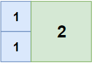
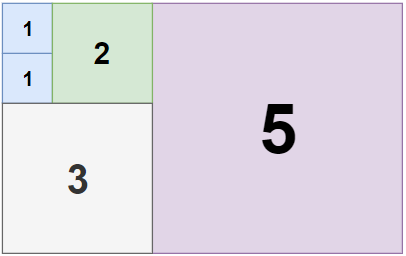
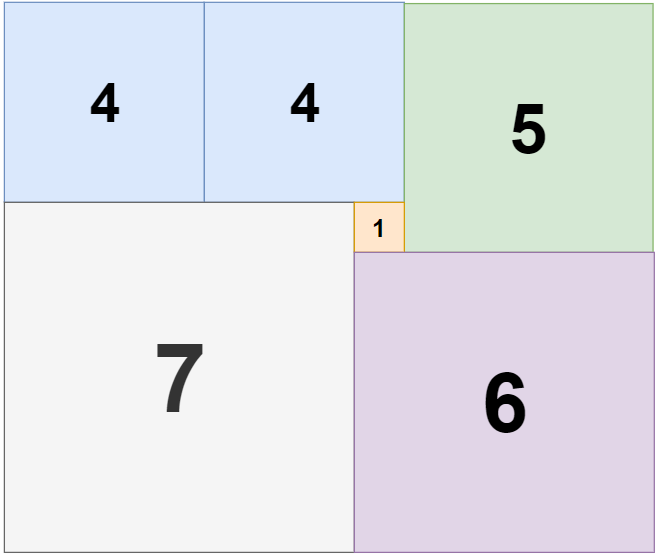

# 1240. 铺瓷砖
## 题目
- 你是一位施工队的工长，根据设计师的要求准备为一套设计风格独特的房子进行室内装修。

- 房子的客厅大小为 `n x m`，为保持极简的风格，需要使用尽可能少的 `正方形` 瓷砖来铺盖地面。

- 假设正方形瓷砖的规格不限，边长都是整数。

- 请你帮设计师计算一下，最少需要用到多少块方形瓷砖？

## 示例
### 示例1
  
``` text
输入：n = 2, m = 3
输出：3
解释：3 块地砖就可以铺满卧室。
     2 块 1x1 地砖
     1 块 2x2 地砖
```
### 示例2
  
``` text
输入：n = 5, m = 8
输出：5
```
### 示例3
  
``` text
输入：n = 11, m = 13
输出：6
```
## 解析
- 通过回溯来遍历所有的可能性，首先是在 $(x, y)$ 点处从最大的可能正方形$min(length - y, width - x)$开始向边长为1的正方形做遍历。
- 同时需要一个boolean数组做记录，如果正方形的覆盖范围内有已经被访问过的点，即已经被其他正方形覆盖，说明现在的方案是不合适的
- 注意剪枝，当计数 $count > result$ 时丢弃当前结果

## 代码
``` java
class Solution {
    int res = 0;
    public int tilingRectangle(int n, int m) {
        res = Math.max(n, m);
        boolean[][] vis = new boolean[n][m];
        dfs(0, 0, vis, 0);
        return res;
    }

    private void dfs(int x, int y, boolean[][] vis, int count) {
        int n = vis.length, m = vis[0].length;
        // 剪枝
        if(count >= res)
            return;
        // 更新结果
        if(x >= n) {
            res = count;
            return;
        }
        // 换行
        if(y >= m) {
            dfs(x + 1, 0, vis, count);
            return;
        }
        // 如果当前节点已被覆盖，访问下一个节点
        if(vis[x][y]) {
            dfs(x, y + 1, vis, count);
            return;
        }

        // 回溯
        for(int k = Math.min(n - x, m - y); k >= 1 && isOk(vis, x, y, k); --k) {
            fills(vis, x, y, k, true);

            dfs(x, y + k, vis, count + 1);

            fills(vis, x, y, k, false);
        }

    }

    //检查区域内是否存在已被覆盖的点
    private boolean isOk(boolean[][] vis, int x, int y, int k) {
        for(int i = 0; i < k; ++i) {
            for(int j = 0; j < k; ++j) {
                if(vis[x + i][y + j])
                    return false;
            }
        }

        return true;
    }
    // 区域覆盖
    private void fills(boolean[][] vis, int x, int y, int k, boolean bool) {
        for(int i = 0; i < k; ++i)
            for(int j = 0; j < k; ++j)
                vis[x + i][y + j] = bool;
    }
}
```