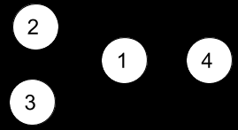
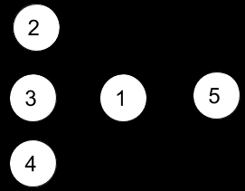

# 并行课程 II

- [并行课程 II](https://leetcode.cn/problems/parallel-courses-ii/)

## 题目
给你一个整数 `n` 表示某所大学里课程的数目，编号为 `1` 到 `n` ，数组 `relations` 中， `relations[i] = [xi, yi]`  表示一个先修课的关系，也就是课程 `xi` 必须在课程 `yi` 之前上。同时你还有一个整数 `k` 。

在一个学期中，你 **最多** 可以同时上 `k` 门课，前提是这些课的先修课在之前的学期里已经上过了。

请你返回上完所有课最少需要多少个学期。题目保证一定存在一种上完所有课的方式。

## 示例
### 示例1
  
``` text
输入：n = 4, relations = [[2,1],[3,1],[1,4]], k = 2
输出：3 
解释：上图展示了题目输入的图。在第一个学期中，我们可以上课程 2 和课程 3 。然后第二个学期上课程 1 ，第三个学期上课程 4 。
```
### 示例2
  
``` text
输入：n = 5, relations = [[2,1],[3,1],[4,1],[1,5]], k = 2
输出：4 
解释：上图展示了题目输入的图。一个最优方案是：第一学期上课程 2 和 3，第二学期上课程 4 ，第三学期上课程 1 ，第四学期上课程 5 。
```

## 解析
- 课程之间存在一个拓扑顺序的问题，需要记录课程选修的先后关系
- 由于n <= 15，所以可以选择位运算的方式存储课程
- 在后续遍历的过程中，通过`&`运算确定当前课程为那些课程的前置课程。

## 代码
``` java
class Solution {
    public int minNumberOfSemesters(int n, int[][] relations, int k) {
        int[] pre = new int[n];
        // 记录课程选修关系
        for(int[] relation : relations) {
            pre[relation[1] - 1] |= (1 << (relation[0] - 1));
        }
        int all = 1 << n;
        // 遍历
        int[] dp = new int[all];
        for(int i = 0; i < all; ++i)
            dp[i] = n;
        dp[0] = 0;
        for(int i = 0; i < all; ++i) {
            int next = 0;
            // 当前状态下可选修的课程
            for(int j = 0; j < n; ++j)
                if((i & pre[j]) == pre[j])
                    next |= 1 << j;
            // 去重，这一步刚开始没想到，有点意思。
            next &= ~i;
            // 遍历获取最小天数
            for(int j = next; j > 0; j = (j - 1) & next) {
                if(Integer.bitCount(j) <= k)
                    dp[i | j] = Math.min(dp[i | j], dp[i] + 1);
            }
        }

        return dp[all - 1];
    }
}
```